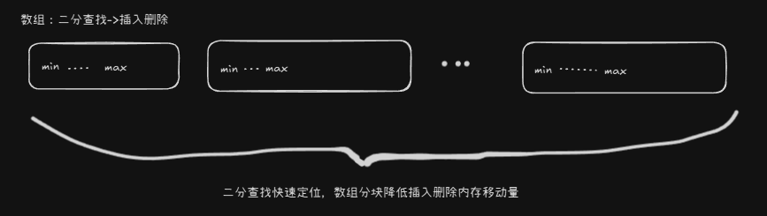

### 挑战目标

排名功能在游戏中十分重要。主要用于激励玩家不断成长。一般排名有以下几种区分
1. 全服/单服
2. TopN(1000)/全部玩家排名
3. 实时排名/定时更新

`TopN(1000)` 和 `定时更新` 暂时不需要讨论，不论怎么实现都可，没有什么难点。常规实现方式就是TreeMap, Redis, 堆排序, 甚至用冒泡排序都可以。

这里主要讨论 `全服排名+实时排名`。玩家可以实时获取自身的所在排序位置，至少支持1000w在榜玩家。每秒支持10w实时更新(不考虑网络层)。

### 信息整理
1. redis底层是使用skiplist来实现的，性能与treemap比肩
2. treemap或者skiplist都无法快速获取指定元素的位置，只能从前往后数，性能极差
3. 二分查找的性能也是log(n)的，而且因为数组是连续的内存，所以性能是远超treemap/skiplist这种内存随机访问的结构
4. 直接的数组结构，无指针，更加省内存
5. 插入排序在小内存上性能较好，支持动态更新。其他排序算法只能在静态数组上排序
6. 经过测试 在单个10w数量级数组上，二分查找+插入排序 的方式实现 map 功能，能够满足`每秒支持10w实时更新`的要求

### 实现思路

基于`二分查找`在顺序`M*N`的数组上进行排序。在`M`上只会进行二分查找, `N`上才会涉及到插入或者删除。这样可以大大奖励内存的移动，保证插入性能。又能获得极致的查找性能, 快速获得元素的位置(排名)。



### 性能测试

bsearch_list 在1kw级别的数据上，仍然能够保持[插入+查找+删除]在`10us`以内完成。一下测试都是以`-O3`编译。

```sh
$ gcc -O3 *.c -o app
$ ./app 10000000 8000 0
start
put time cost: 43112ms, count=10000000. 4.31127us/op
put one time cost: 3us, count=10000001
get one time cost: 1us, count=10000001
get time cost: 7968ms, 0.796849us/op. error=0
del time cost: 24563ms, count=1. 2.45634us/op, error=0

$ ./app 10000000 8000 0
put time cost: 43361ms, count=10000000. 4.33611us/op
put one time cost: 2us, count=10000001
get one time cost: 0us, count=10000001
get time cost: 8536ms, 0.853652us/op. error=0
del time cost: 25340ms, count=1. 2.53402us/op, error=0
```

对比map的实现：
```sh
$ g++ -O3 test_map.cpp -o app
$ ./app 10000000
start
put time cost: 12945ms, count=10000000. 1.29454us/op
put one cost: 3us
get pos cost: 101946us, pos=793462
```

总结：

1. map插入性能好，应为数树结构，不需要移动内存。但是获取排名性能极差，无法用于实时排名。
2. bsearch_list：即使在1kw的数据，实时更新获取排名也能在`10us(获取1us,插入5us,删除3us)`以内完成
3. bsearch_list的缺陷可以通过内存硬件的优化提升(提升内存移动速度)，获得更大的并发。
4. bsearch_list代码及其简单，基于数组。可以自定义内存的申请和释放。很容易利用mmap/共享内存实现持久化。